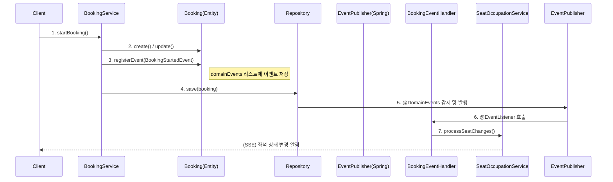

# 이벤트 기반 좌석 점유 시스템 설계

## 개정이력
| 버전 | 일자 | 작성자 | 내용 |
|------|------|--------|------|
| 1.0 | 2026-01-02 | Gemini | 최초 작성 |

---

## 1. 개요
본 문서는 `BookingService`와 `SeatOccupationService` 간의 강한 결합을 해결하기 위해 도입된 **도메인 이벤트(Domain Event) 기반 아키텍처**를 설명합니다. Spring Data JPA의 이벤트 발행 기능을 활용하여, 예매 상태 변경과 좌석 점유 로직을 분리했습니다.

## 2. 도입 배경 및 목적
*   **강한 결합도(Tight Coupling) 해소**: 예매 비즈니스 로직(`BookingService`) 내에 좌석 점유 상세 구현(`SeatOccupationService`)이 직접 호출되는 구조를 개선합니다.
*   **단일 책임 원칙(SRP) 준수**: `BookingService`는 예매의 생명주기 관리에만 집중하고, 좌석 점유, 알림 발송 등의 부가 작업은 이벤트 핸들러에게 위임합니다.
*   **확장성 확보**: 추후 이메일 발송, 알림톡 전송, 통계 집계 등 예매 상태 변경에 따른 추가 작업이 필요할 때, 기존 코드를 수정하지 않고 핸들러만 추가하여 기능을 확장할 수 있습니다.

## 3. 이벤트 아키텍처 설계

### 3.1 이벤트 정의
`Booking` 도메인(Aggregate Root)에서 발생하는 핵심 상태 변경을 3가지 이벤트로 정의했습니다.

| 이벤트 클래스 | 발생 시점 | 주요 데이터 | 역할 |
|---|---|---|---|
| `BookingStartedEvent` | 예매 시작 (좌석 선택) | `bookingId`, `seatChanges`(유지/추가/해제 목록) | 좌석 선점(PENDING) 처리, SSE 실시간 좌석 점유 알림 |
| `BookingConfirmedEvent` | 결제 완료 / 예매 확정 | `bookingId`, `seats`, `seatGrade` | 좌석 확정(RESERVED) 처리, 판매 완료 알림 |
| `BookingCancelledEvent` | 예매 취소 / 미결제 취소 | `bookingId`, `userId`, `seats` | 좌석 점유 해제, 해제 알림 |

### 3.2 처리 흐름 (Event Flow)



### 3.3 트랜잭션 처리 전략
현재 구현은 **동기적 트랜잭션 처리** 방식을 따릅니다.
*   `BookingService`의 트랜잭션 범위 내에서 이벤트 핸들러가 실행됩니다.
*   이유: 예매 데이터 생성과 좌석 점유는 데이터 정합성이 매우 중요하므로, 둘 중 하나라도 실패하면 전체 롤백되어야 합니다.
*   (참고) 향후 이메일 발송 등 트랜잭션과 무관한 작업 추가 시 `@TransactionalEventListener(phase = AFTER_COMMIT)` 또는 `@Async`를 활용하여 분리할 수 있습니다.

## 4. 구현 상세

### 4.1 도메인 엔티티 (`Booking`)
Spring Data JPA의 `@DomainEvents`를 활용하여 엔티티가 스스로 이벤트를 관리합니다.

```kotlin
@Entity
class Booking(...) : BaseEntity() {
    @Transient
    private val domainEvents = mutableListOf<Any>()

    fun registerEvent(event: Any) {
        domainEvents.add(event)
    }

    @DomainEvents
    fun domainEvents(): Collection<Any> = domainEvents.toList()

    @AfterDomainEventPublication
    fun clearDomainEvents() = domainEvents.clear()
}
```

### 4.2 이벤트 핸들러 (`BookingEventHandler`)
이벤트를 수신하여 실제 비즈니스 로직(`SeatOccupationService`)을 수행합니다.

```kotlin
@Component
class BookingEventHandler(
    private val seatOccupationService: SeatOccupationService,
    ...
) {
    @EventListener
    @Transactional
    fun handleBookingStarted(event: BookingStartedEvent) {
        // 좌석 점유 테이블 업데이트
        seatOccupationService.processSeatChanges(...)
        // SSE 알림 전송
        seatOccupationService.publishSeatEvents(...)
    }
    // ... Confirmed, Cancelled 핸들러
}
```

## 5. 기대 효과
1.  **코드 가독성 향상**: `BookingService` 코드가 예매 흐름 자체에만 집중되어 간결해졌습니다.
2.  **테스트 용이성**: `BookingService` 테스트 시 `SeatOccupationService` Mocking 복잡도가 줄어들고, 이벤트 발생 여부만 검증하면 됩니다.
3.  **유연한 구조**: 좌석 점유 로직이 변경되거나 새로운 후처리 작업이 생겨도 `Booking` 도메인 로직을 건드릴 필요가 없습니다.
