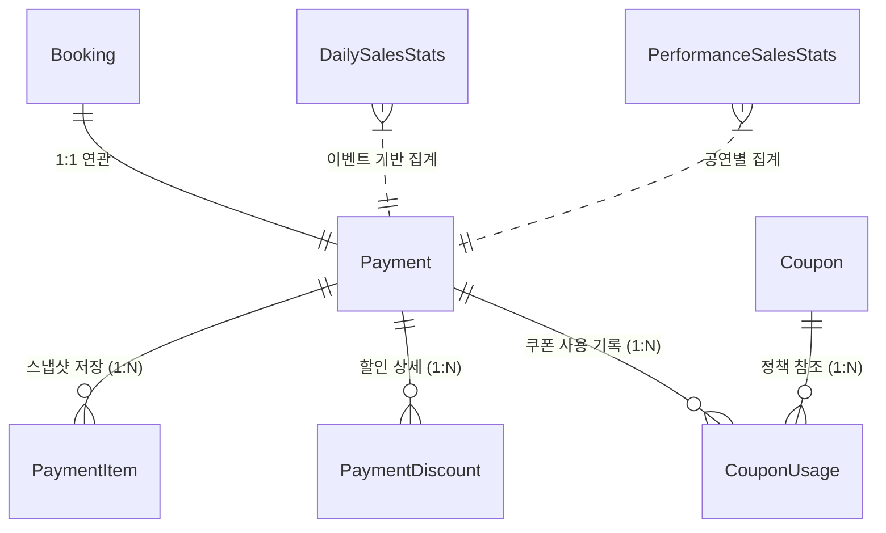

# 결제 데이터 수집 시스템 설계

## 개정이력
| 버전 | 일자 | 작성자 | 내용 |
|------|------|--------|------|
| 1.0 | 2025-01-05 | Claude | 최초 작성 |
| 1.1 | 2025-01-05 | Claude | completeManually() 메서드 추가 |
| 1.2 | 2026-01-05 | Gemini | 현재 프로젝트 구현 상태 반영 (FE 제안 통합, 리팩토링된 쿠폰/통계 시스템 적용) |

---

## 1. 개요

### 1.1 목적
예매 시스템에서 결제 관련 데이터를 체계적으로 수집하여 매출 분석, 할인 효과 측정, 결제 행동 분석 등 비즈니스 인사이트를 도출하기 위한 데이터 모델 설계 및 구현 가이드.

### 1.2 주요 기능
- **결제 라이프사이클 관리**: PENDING → COMPLETED → CANCELLED/REFUNDED 상태 추적.
- **데이터 스냅샷**: 결제 시점의 좌석 가격, 등급, 공연 정보를 `PaymentItem`으로 영속화하여 원본 데이터 변경에 영향받지 않는 기록 보존.
- **통합 할인 엔진**: 쿠폰, 포인트, 프로모션 등 다양한 할인 수단을 `PaymentDiscount`로 단일화하여 관리.
- **실시간 매출 집계**: 결제 완료 이벤트를 구독하여 일별/공연별/수단별 통계를 즉시 갱신.

---

## 2. 도메인 설계

### 2.1 Payment (결제 - Aggregate Root)

#### 2.1.1 핵심 로직
- **`validateAmount`**: 클라이언트가 계산하여 보낸 금액과 서버의 정책 금액이 일치하는지 도메인 레벨에서 검증하여 금액 위변조 방지.
- **`addDiscount`**: 할인을 적용할 때마다 `finalPrice`를 재계산하여 정합성 유지.
- **상태 전이**: 엔티티 내부 메서드(`complete`, `cancel`, `refund`)를 통해 상태 변경 비즈니스 규칙 강제.

#### 2.1.2 엔티티 구조 (핵심 요약)
- `booking`: 1:1 관계의 예매 정보.
- `paymentNumber`: `PYM-yyyyMMdd-random` 형식의 고유 번호.
- `paymentItems`: 결제 당시의 상품(좌석) 정보 스냅샷 리스트.
- `discounts`: 적용된 모든 할인 상세 내역 리스트.

---

### 2.2 PaymentItem (결제 상세 내역)
- **목적**: 결제 확정 시점의 상품 정보를 박제(Snapshot).
- **수집 데이터**: `performanceTitle`, `seatGrade`, `seatLabel`, `unitPrice`, `finalPrice`.
- **특징**: 원본 공연 정보나 좌석 가격이 나중에 바뀌더라도, 결제 당시의 가격과 정보를 그대로 유지함.

---

### 2.3 Coupon & Discount (할인 시스템)
- **Coupon**: 쿠폰의 정책(정액/정률, 유효기간, 인당 제한) 관리.
- **CouponUsage**: 사용자가 특정 결제(`paymentId`)에서 어떤 좌석(`seatId`)에 쿠폰을 썼는지 기록.
- **일괄 처리**: `useCoupons`, `restoreCoupons` 인터페이스를 통해 한 번의 결제에 포함된 여러 장의 쿠폰을 원자적으로 처리.

---

## 3. 통계 및 집계 시스템

### 3.1 실시간 집계 전략
- **방식**: `PaymentCompletedEvent` 발생 시 `SalesStatsService.updateAllStats()` 호출.
- **독립 트랜잭션**: `Propagation.REQUIRES_NEW`를 사용하여 통계 집계 실패가 메인 결제 로직에 영향을 주지 않도록 격리.
- **동시성 제어**: 대량의 동시 결제 상황에서 집계 누락을 막기 위해 리포지토리에 **비관적 락(Pessimistic Lock)** 적용.

### 3.2 집계 차원 (Stats Entities)
1.  **DailySalesStats**: 일별 총 매출, 순매출, 거래 건수, 티켓 수, 평균 단가.
2.  **PerformanceSalesStats**: 공연별 매출 현황 및 좌석 점유율(Occupancy Rate).
3.  **PaymentMethodStats**: 결제 수단별(카드, 카카오페이 등) 이용 비중 분석.
4.  **DiscountStats**: 할인 종류별 사용 빈도 및 마케팅 효과(ROI) 분석.

---

## 4. API 명세 (최신 구현 기준)

### 4.1 결제 API (`/api/payments`)
- `POST /`: 결제 요청 생성 (약관 동의 및 할인 내역 포함).
- `POST /{id}/complete`: PG 승인 결과 반영.
- `POST /{id}/cancel`: 결제 취소 및 쿠폰 자동 복구.
- `GET /{id}`: 결제 상세 및 아이템 스냅샷 조회.

### 4.2 통계 API (`/api/admin/stats`)
- `GET /daily`: 특정 날짜 매출 요약.
- `GET /performance/{id}`: 특정 공연의 날짜별 매출 추이.
- `GET /methods`: 결제 수단 분포도.
- `GET /discounts`: 할인 정책별 실적.

---

## 5. 데이터 관계도 (ERD)

### 5.1 주요 관계 설명
- **Booking ↔ Payment**: 하나의 예매는 하나의 최종 결제 정보를 가집니다.
- **Payment ↔ PaymentItem**: 결제 시점의 좌석 가격과 정보를 보존하기 위한 1:N 관계입니다. (예매된 좌석 수만큼 생성)
- **Payment ↔ PaymentDiscount**: 한 결제에 적용된 여러 할인(쿠폰, 포인트 등)을 개별 행으로 관리합니다.
- **Coupon ↔ CouponUsage**: 쿠폰의 정책 정보와 실제 사용된 이력(어떤 결제에서 어떤 좌석에 쓰였는지)을 연결합니다.

---

## 6. 주요 비즈니스 워크플로우

### 6.1 결제 생성 및 검증 흐름 (POST /api/payments)
1.  **예매 조회**: `bookingId`로 현재 예매 상태 및 소유권 확인.
2.  **데이터 스냅샷**: `BookingSeat` 정보를 복사하여 `PaymentItem` 생성 (결제 시점 가격 고정).
3.  **할인 적용**: 전달된 `discounts` 리스트를 검증하고 `PaymentDiscount` 생성.
4.  **쿠폰 선점**: `COUPON` 타입 할인이 있다면 `CouponService.useCoupons`를 호출하여 사용 상태로 변경.
5.  **금액 이중 검증**: `서버 계산가(원가-할인+수수료) == 클라이언트 요청가` 여부 확인.
6.  **결제 생성**: `PENDING` 상태의 `Payment` 저장.

### 6.2 결제 완료 및 통계 집계 흐름 (POST /api/payments/{id}/complete)
1.  **상태 변경**: `Payment` 상태를 `COMPLETED`로 변경 및 PG 승인 정보(TID 등) 기록.
2.  **이벤트 발행**: `PaymentCompletedEvent` 발행.
3.  **실시간 집계 (비동기)**: `PaymentEventHandler`가 이벤트를 수신하여 `SalesStatsService` 호출.
4.  **통계 업데이트**: 비관적 락을 획득하여 `DailySalesStats`, `PerformanceSalesStats` 등을 갱신.

### 6.3 결제 취소 및 복구 흐름 (POST /api/payments/{id}/cancel)
1.  **상태 변경**: `Payment` 상태를 `CANCELLED`로 변경.
2.  **혜택 복구**: `CouponService.restoreCoupons`를 호출하여 사용된 쿠폰을 다시 `AVAILABLE`로 변경.
3.  **통계 반영**: `PaymentCancelledEvent`를 통해 매출 통계에서 해당 금액만큼 차감 처리 (또는 취소 건수 증가).

---

## 7. 데이터 무결성 가이드

### 7.1 금액 검증 프로세스
1.  FE에서 예매 및 할인 적용 후 `totalAmount` 계산.
2.  BE 요청 시 `discounts` 상세 리스트와 함께 전달.
3.  BE는 `Booking` 정보를 조회하여 원가를 재계산하고, `discounts`의 유효성을 검증한 뒤 서버측 `finalPrice` 산출.
4.  `server.finalPrice == request.totalAmount`가 다를 경우 즉시 차단.

### 7.2 예외 상황 복구
- **결제 실패/취소 시**: `PaymentCancelledEvent` 등을 통해 사용된 쿠폰 상태를 자동으로 `AVAILABLE`로 원복하거나 `CouponUsage` 기록을 삭제/복구함.
- **통계 정정**: 환불 발생 시 `recordDailyRefund`를 통해 실시간으로 `totalRefunds`와 `netSales` 반영.