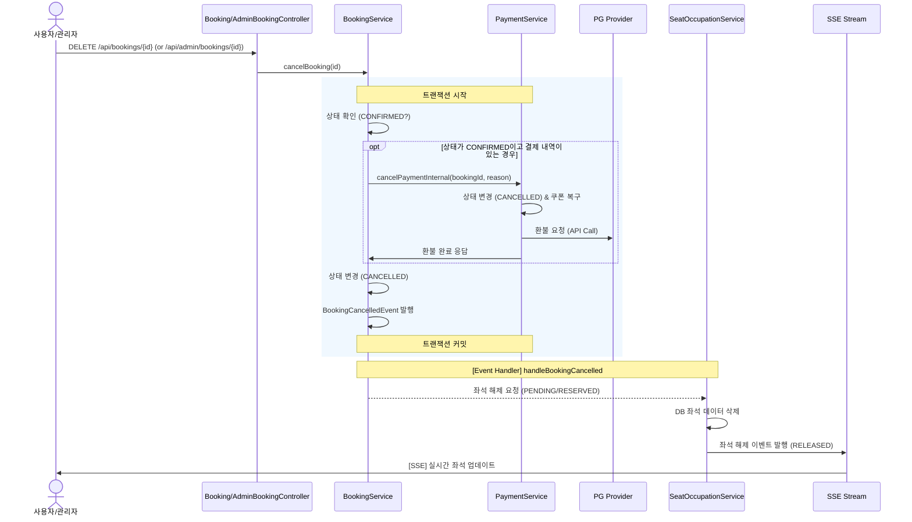

# 예매 취소 및 환불 워크플로우 (통합 가이드)

| 버전 | 날짜 | 작성자 | 변경 내용 |
|------|------|--------|----------|
| 1.0  | 2026-02-07 | Gemini | 초기 버전 작성 |
| 1.1  | 2026-02-07 | Gemini | FE 테스트 가이드 통합 및 단일 진입점 구조 반영 |

## 1. 개요

본 문서는 예매 시스템의 **취소 및 환불 프로세스**와 이를 검증하기 위한 **테스트 가이드**를 포함합니다. 
사용자 또는 시스템에 의해 예매 취소가 발생했을 때, **예매 상태(Booking)**, **결제 상태(Payment)**, **좌석 상태(SeatStatus)**가 어떻게 원자적으로 동기화되는지 정의합니다.

---

## 2. 통합 취소 프로세스

취소 요청은 사용자용과 관리자용 API 진입점을 통해 접수되지만, 내부적으로는 동일한 통합 취소 프로세스(`processCancellation`)를 수행하여 결제 환불 및 좌석 해제를 처리합니다.

### 진입점 1: 사용자 예매 취소
- **API**: `DELETE /api/bookings/{bookingId}`
- **상황**: 사용자가 "마이페이지 > 예매 내역"에서 취소 버튼 클릭
- **특징**: 본인의 예매인지 소유권 검증(`validateBookingOwner`) 수행

### 진입점 2: 관리자 강제 취소
- **API**: `DELETE /api/admin/bookings/{bookingId}`
- **상황**: 관리자가 운영상 필요에 의해 특정 예매를 강제 취소
- **특징**: 소유권 검증 없이 처리되며, Audit Log에 기록됨

### 진입점 3: 시스템 자동 취소 (Scheduler)
- **상황**: 예매 대기 시간(5분) 초과 시 스케줄러에 의해 자동 만료 처리 (`EXPIRED` 상태 변경 및 좌석 해제)

---

## 3. 시퀀스 다이어그램

---

## 4. 검증 및 테스트 가이드 (FE/QA)

### 4.1 사전 준비
1. **Swagger UI**: `/swagger-ui.html` 접속 또는 API 툴 준비.
2. **SSE 구독**: `/api/schedules/{id}/seats/stream` 연결 (좌석 해제 실시간 확인용).

### 4.2 테스트 시나리오

#### 시나리오 A: [결제 전] 예매 취소
**목표**: 좌석 선점(`PENDING`) 상태에서 취소 시 즉시 해제되는지 확인.
1. **예매 시작**: [결제하기] 클릭 (`POST /api/bookings/start`).
2. **취소 요청**: 페이지 이탈 또는 취소 클릭 (`DELETE /api/bookings/{bookingId}`).
3. **검증**:
    - **API 응답**: 200 OK.
    - **화면(SSE)**: 좌석이 즉시 '선택 가능' 상태로 복구됨.

#### 시나리오 B: [결제 완료 후] 예매 취소 (환불)
**목표**: 결제 완료(`CONFIRMED`) 후 취소 시 결제 취소 및 좌석 해제 확인.
1. **결제 완료**: 예매 및 결제 프로세스 완료.
2. **취소 요청**: 마이페이지 > 예매 내역 > [예매 취소] 클릭 (`DELETE /api/bookings/{bookingId}`).
3. **검증**:
    - **API 응답**: 200 OK.
    - **DB/상태**: `Booking` 및 `Payment` 상태 모두 `CANCELLED` 확인.
    - **화면(SSE)**: 좌석이 '선택 가능' 상태로 복구됨.

---

## 5. 구현 가이드

- **PaymentService**: `cancelPaymentInternal`은 결제 취소와 환불 로직만 담당하며, 외부 API로 노출하지 않습니다.
- **BookingService**: 전체 취소 흐름을 제어합니다. 결제 상태를 확인하여 환불을 트리거하고 이벤트를 통해 좌석을 해제합니다.
- **예외 처리**: 본인 소유가 아닌 예매 건(403)이나 이미 취소된 건(409)에 대한 처리가 포함되어야 합니다.

---

## 6. 주의사항

- **단일 진입점**: 결제 취소 버튼이 UI상에 여러 곳에 있더라도(예매 내역, 결제 내역 등), 백엔드 API는 항상 `DELETE /api/bookings/{id}`를 호출하도록 통일합니다.
- **좌석 정합성**: 취소 실패 시 좌석이 계속 점유된 상태로 남지 않도록 트랜잭션 및 이벤트 처리에 유의합니다.