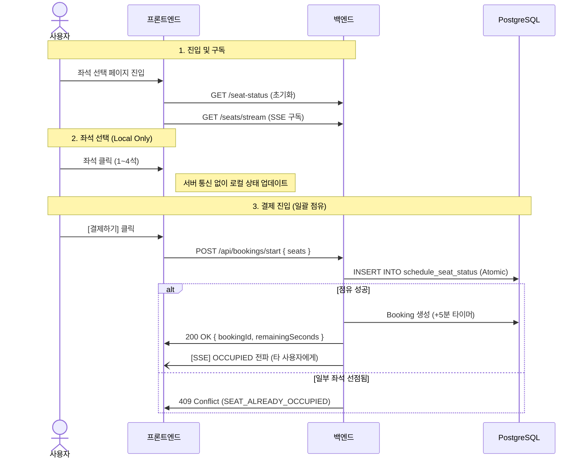

# 좌석 예매 시스템 가이드

| 버전 | 날짜 | 작성자 | 변경 내용 |
|------|------|--------|----------|
| 1.0  | 2025-12-10 | BE | 초안 작성 |
| 1.1  | 2025-12-18 | Gemini | 최신 구현 내용 반영 |
| 1.2  | 2025-12-18 | BE | 좌석 배치도 저장 API 통합 |
| 1.3  | 2025-12-18 | BE | seatingChart 타입을 JSON Object로 변경 |
| 1.4  | 2025-12-18 | BE | 등급별 좌석수 별도 CRUD API 제거 |
| 2.0  | 2025-12-21 | BE | 5분 타이머 기반 예매 시스템으로 재설계, Booking 엔티티 추가 |
| 3.0  | 2025-12-22 | Gemini | 결제 단계 일괄 점유 및 SSE 실시간 동기화 방식 반영 (NOL 방식 지향) |
| 3.1  | 2025-12-26 | Claude | Write-Time Calculation 적용 - TicketOption.totalQuantity, ScheduleSeatStatus.seatGrade 추가 |
| 3.2  | 2026-02-07 | Gemini | 예매 취소 및 결제 환불 통합 프로세스 정의 |

## 목차

1. [개요](#1-개요)
2. [핵심 설계 원칙](#2-핵심-설계-원칙)
3. [데이터 모델](#3-데이터-모델)
4. [API 엔드포인트](#4-api-엔드포인트)
5. [예매 흐름](#5-예매-흐름)
6. [동시성 처리](#6-동시성-처리)
7. [실시간 동기화 (SSE)](#7-실시간-동기화-sse)
8. [오류 처리](#8-오류-처리)

---

## 1. 개요

본 시스템은 **결제 진입 시점의 일괄 좌석 점유**와 **SSE를 통한 실시간 좌석 상태 동기화**를 지원하는 고효율 예매 시스템입니다. 사용자가 좌석을 고르는 동안은 서버 부하를 최소화하고, 결제 단계에서 강력한 동시성 제어를 수행합니다.

### 핵심 개념

| 개념 | 설명 |
|------|------|
| **Booking** | 예매 (5분 타이머 및 결제 상태 관리) |
| **ScheduleSeatStatus** | 회차별 좌석 상태 (점유/확정/해제) |
| **SSE Stream** | 실시간 좌석 상태 변경 알림 채널 |

---

## 2. 핵심 설계 원칙

1. **결제 시점 일괄 점유 (Atomic Lock on Checkout):** 
    - 좌석 선택 시에는 서버 요청 없이 클라이언트 로컬 상태로 관리합니다.
    - [결제하기] 버튼 클릭 시 선택한 모든 좌석(최대 4석)을 한꺼번에 점유 시도합니다.
2. **PostgreSQL Unique 제약 조건 활용:**
    - RDB의 `(schedule_id, row_num, col_num)` Unique Index를 활용하여 원자적 락을 수행합니다.
3. **SSE 기반 실시간 전파:**
    - 타 사용자의 점유/확정 정보를 실시간으로 푸시하여 '이선좌' 경험을 최소화합니다.

---

## 3. 데이터 모델

### 3.1 Booking (예매)

| 컬럼 | 타입 | 설명 |
|------|------|------|
| id | UUID | PK |
| status | VARCHAR(20) | PENDING/CONFIRMED/CANCELLED/EXPIRED |
| expires_at | TIMESTAMP | 만료 시각 (생성 시점 + 5분) |
| total_price | INT | 총 결제 금액 |

### 3.2 ScheduleSeatStatus (좌석 상태)

| 컬럼 | 타입 | 설명 |
|------|------|------|
| schedule_id | BIGINT | 공연 회차 FK |
| row_num | INT | 행 번호 |
| col_num | INT | 열 번호 |
| seat_grade | VARCHAR(20) | 좌석 등급 (VIP/R/S/A) - v3.1 추가 |
| seat_status | VARCHAR(20) | PENDING(점유 중) / RESERVED(확정) |

**UNIQUE Index:** `uk_schedule_seat (schedule_id, row_num, col_num)`

### 3.3 TicketOption (티켓 옵션) - v3.1 변경

| 컬럼 | 타입 | 설명 |
|------|------|------|
| performance_schedule_id | BIGINT | 공연 회차 FK |
| seat_grade | VARCHAR(20) | 좌석 등급 |
| price | INT | 가격 |
| total_quantity | INT | 해당 등급의 총 좌석 수 (v3.1 추가) |

> **v3.1 변경사항**: 스케줄 생성 시 Venue의 seatingChart에서 등급별 좌석 수를 계산하여 `total_quantity`에 저장 (Write-Time Calculation)

---

## 4. API 엔드포인트

### 4.1 예매 API

| Method | URL | 설명 |
|--------|-----|------|
| POST | `/api/bookings/start` | 일괄 좌석 점유 및 예매 시작 (타이머 시작) |
| GET | `/api/bookings/{id}/time` | 남은 시간 조회 (새로고침 대응) |
| POST | `/api/bookings/{id}/confirm` | 결제 완료 (예매 최종 확정) |
| DELETE | `/api/bookings/{id}` | 예매 취소 (결제 전: 좌석 해제, 결제 후: 환불 + 좌석 해제) |

### 4.2 좌석 상태 및 SSE

| Method | URL | 설명 |
|--------|-----|------|
| GET | `/api/schedules/{id}/seat-status` | 초기 좌석 상태 조회 |
| GET | `/api/schedules/{id}/seats/stream` | 실시간 좌석 상태 스트림 구독 (SSE) |

---

## 5. 예매 흐름



---

## 6. 동시성 처리

- **원자성 보장**: 복수의 좌석을 하나의 트랜잭션으로 처리합니다. 하나라도 실패하면 전체 롤백됩니다.
- **Race Condition 방지**: DB Unique Index 위반 시 발생하는 예외를 Catch하여 사용자에게 알립니다.

---

## 7. 실시간 동기화 (SSE)

### 메시지 구조
```json
{
  "action": "OCCUPIED | RELEASED | CONFIRMED",
  "seats": [{ "row": 1, "col": 5 }]
}
```
- **OCCUPIED**: 누군가 결제 단계 진입 (화면에서 회색 처리)
- **RELEASED**: 결제 취소 또는 타임아웃 (화면에서 선택 가능 처리)
- **CONFIRMED**: 결제 완료 (화면에서 판매 완료 처리)

---

## 8. 오류 처리

| 코드 | 설명 |
|------|------|
| SEAT_ALREADY_OCCUPIED | 선택한 좌석 중 이미 점유된 좌석이 있음 (409) |
| BOOKING_EXPIRED | 5분 결제 제한 시간이 만료됨 (410) |
| SEAT_LIMIT_EXCEEDED | 최대 4석 제한 위반 (400) |

---

## 9. 예매 취소 통합 프로세스


예매 취소 시 결제 상태에 따라 환불 및 좌석 해제가 원자적으로 수행됩니다.


### 9.1 통합 취소 (DELETE /api/bookings/{id})

취소 요청은 예매 취소 API를 통해 단일 진입점으로 처리됩니다.


- **결제 전 (PENDING)**: 즉시 예매를 취소하고 좌석 점유를 해제(`RELEASED`)합니다.

- **결제 후 (CONFIRMED)**: 

    1. 내부적으로 결제 시스템(`PaymentService`)을 호출하여 환불 프로세스를 수행합니다.

    2. 쿠폰 사용 내역이 있다면 자동으로 복구합니다.

    3. 예매 및 결제 상태를 모두 `CANCELLED`로 변경합니다.

    4. 최종적으로 좌석 상태를 해제(`RELEASED`)하고 SSE 이벤트를 전파합니다.


> **주의**: 결제 취소 API를 별도로 호출하는 대신, 항상 예매 취소 API를 통해 전체 프로세스를 트리거합니다. 이를 통해 데이터 정합성을 보장하고 중복 로직을 방지합니다.
