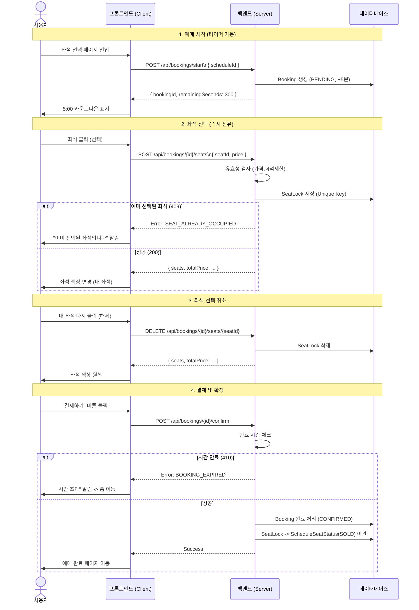

# 좌석 예매 시스템 가이드

| 버전 | 날짜 | 작성자 | 변경 내용 |
|------|------|--------|----------|
| 1.0  | 2025-12-10 | BE | 초안 작성 |
| 1.1  | 2025-12-18 | Gemini | 최신 구현 내용 반영 |
| 1.2  | 2025-12-18 | BE | 좌석 배치도 저장 API 통합 |
| 1.3  | 2025-12-18 | BE | seatingChart 타입을 JSON Object로 변경 |
| 1.4  | 2025-12-18 | BE | 등급별 좌석수 별도 CRUD API 제거 |
| 2.0  | 2025-12-21 | BE | 5분 타이머 기반 예매 시스템으로 재설계, Booking 엔티티 추가 |

## 목차

1. [개요](#1-개요)
2. [데이터 모델](#2-데이터-모델)
3. [API 엔드포인트](#3-api-엔드포인트)
4. [예매 흐름](#4-예매-흐름)
5. [동시성 처리](#5-동시성-처리)
6. [만료 예매 자동 정리](#6-만료-예매-자동-정리)
7. [오류 처리](#7-오류-처리)

---

## 1. 개요

본 시스템은 **5분 타이머 기반** 개별 좌석 선택 방식의 공연 예매를 지원합니다.

### 핵심 개념

| 개념 | 설명 |
|------|------|
| Venue | 공연장 |
| VenueSeatCapacity | 공연장 등급별 허용 좌석수 |
| Performance | 공연 |
| PerformanceSchedule | 공연 회차 |
| TicketOption | 공연 회차별 티켓 옵션 (등급, 가격) |
| **Booking** | 예매 (5분 타이머 관리) |
| **BookingSeat** | 예매 좌석 |
| **SeatLock** | 좌석 점유 (동시성 제어용) |

### 주요 특징

- **5분 타이머**: 좌석 선택 → 결제 완료까지 5분 제한
- **서버 측 타이머 관리**: 페이지 새로고침/브라우저 종료에도 유지
- **최대 4석 제한**: 1인당 최대 4석까지 선택 가능
- **자동 만료 처리**: 스케줄러가 1분마다 만료 예매 정리

---

## 2. 데이터 모델

### 2.1 Booking (예매)

| 컬럼 | 타입 | 설명 |
|------|------|------|
| id | BIGSERIAL | PK |
| user_id | BIGINT | 예매자 FK |
| schedule_id | BIGINT | 공연 회차 FK |
| status | VARCHAR(20) | 상태 (PENDING/CONFIRMED/CANCELLED/EXPIRED) |
| expires_at | TIMESTAMP | 만료 시각 (생성 시점 + 5분) |
| total_price | INT | 총 결제 금액 |
| booking_number | VARCHAR(50) | 예매 번호 |

### 2.2 BookingSeat (예매 좌석)

| 컬럼 | 타입 | 설명 |
|------|------|------|
| id | BIGSERIAL | PK |
| booking_id | BIGINT | 예매 FK |
| section | VARCHAR(10) | 구역 |
| row | VARCHAR(10) | 열 |
| seat_number | INT | 좌석 번호 |
| grade | VARCHAR(20) | 좌석 등급 |
| price | INT | 가격 |

### 2.3 SeatLock (좌석 점유)

| 컬럼 | 타입 | 설명 |
|------|------|------|
| id | BIGSERIAL | PK |
| schedule_id | BIGINT | 공연 회차 FK |
| booking_id | BIGINT | 예매 FK |
| section | VARCHAR(10) | 구역 |
| row_name | VARCHAR(10) | 열 |
| seat_number | INT | 좌석 번호 |
| expires_at | TIMESTAMP | 만료 시각 |

**UNIQUE 제약조건:** (schedule_id, section, row_name, seat_number)

### 2.4 BookingStatus (예매 상태)

| 상태 | 설명 |
|------|------|
| PENDING | 진행 중 (좌석 선택 ~ 결제 대기) |
| CONFIRMED | 결제 완료 |
| CANCELLED | 사용자 취소 |
| EXPIRED | 시간 만료 |

---

## 3. API 엔드포인트

### 3.1 예매 API (사용자)

| Method | URL | 설명 | 권한 |
|--------|-----|------|------|
| POST | `/api/bookings/start` | 예매 시작 (5분 타이머 시작) | USER |
| POST | `/api/bookings/{bookingId}/seats` | 좌석 선택 (점유) | USER |
| GET | `/api/bookings/{bookingId}/time` | 남은 시간 조회 | USER |
| POST | `/api/bookings/{bookingId}/confirm` | 결제 완료 (예매 확정) | USER |
| DELETE | `/api/bookings/{bookingId}` | 예매 취소 | USER |

### 3.2 공연장 API (Admin)

| Method | URL | 설명 | 권한 |
|--------|-----|------|------|
| POST | `/api/admin/venues` | 공연장 생성 | ADMIN |
| GET | `/api/venues/{id}` | 공연장 조회 | 누구나 |
| PUT | `/api/admin/venues/{id}` | 공연장 수정 | ADMIN |
| DELETE | `/api/admin/venues/{id}` | 공연장 삭제 | ADMIN |
| GET | `/api/venues/{id}/seating-chart` | 좌석 배치도 조회 | 누구나 |
| PUT | `/api/admin/venues/{id}/seating-chart` | 좌석 배치도 저장 | ADMIN |

### 3.3 공연 회차 API (Admin)

| Method | URL | 설명 | 권한 |
|--------|-----|------|------|
| POST | `/api/admin/performances/{performanceId}/schedules` | 회차 생성 | ADMIN |
| GET | `/api/admin/performances/{performanceId}/schedules` | 회차 목록 조회 | ADMIN |
| PUT | `/api/admin/schedules/{scheduleId}` | 회차 수정 | ADMIN |
| DELETE | `/api/admin/schedules/{scheduleId}` | 회차 삭제 | ADMIN |

---

## 4. 예매 흐름

### 4.1 시퀀스 다이어그램



### 4.2 타이머 및 정책 관리

| 항목 | 정책 |
|------|------|
| 저장 위치 | DB (Booking.expiresAt) |
| 계산 방식 | `remainingSeconds = expiresAt - now` |
| 새로고침 대응 | GET /time API로 서버 시간 기준 조회 |
| 만료 처리 | 스케줄러가 1분마다 자동 처리, 만료 시 사용자에게 알림 후 홈 이동 |
| 좌석 해제 | 사용자가 선택한 좌석을 다시 클릭하여 취소 가능 (필수 UX) |
| 가격 검증 | 클라이언트 가격 신뢰 X, 서버 기준 가격으로 계산 및 검증 |
| 동시성 이슈 | SeatLock 테이블의 Unique Constraint 활용 |

---

## 5. 동시성 처리 및 데이터 무결성

### 5.1 전략: DB Unique 제약 + 낙관적 락(Optional)

`SeatLock` 테이블의 Unique 제약조건으로 동일 좌석 중복 점유 방지.

| 상황 | 처리 |
|------|------|
| 동일 좌석 동시 선택 | 후발 요청 실패 (409 Conflict - SEAT_ALREADY_OCCUPIED) |
| 다중 좌석 선택 시 데드락 | (향후 기능) 좌석 ID/번호 오름차순으로 순차적 Lock 획득 강제 |
| 결제 중 타이머 만료 | confirm API에서 만료 체크 (410 Gone) |

### 5.2 영구 점유 (데이터 이관)

`SeatLock`은 임시 점유 데이터입니다. 결제가 완료되면 반드시 영구적인 좌석 상태 테이블(`ScheduleSeatStatus` 등)로 데이터를 이관해야 합니다.
- **Before Confirm**: SeatLock 존재
- **After Confirm**: SeatLock 삭제 -> ScheduleSeatStatus (SOLD) 생성

---

## 6. 만료 예매 자동 정리

### 6.1 스케줄러

`@Scheduled(fixedRate = 60000)` - 1분마다 실행

### 6.2 처리 내용

1. `status = PENDING AND expires_at < now` 인 Booking 조회
2. 해당 Booking의 status를 EXPIRED로 변경
3. 관련 SeatLock 삭제

---

## 7. 오류 처리

| HTTP | 코드 | 설명 |
|------|------|------|
| 404 | BOOKING_NOT_FOUND | 해당 예매를 찾을 수 없습니다 |
| 410 | BOOKING_EXPIRED | 예매 시간이 만료되었습니다 |
| 400 | BOOKING_INVALID_STATUS | 유효하지 않은 예매 상태입니다 |
| 400 | SEAT_LIMIT_EXCEEDED | 최대 선택 가능 좌석 수(4석)를 초과했습니다 |
| 409 | SEAT_ALREADY_OCCUPIED | 이미 선택된 좌석입니다 |
| 400 | PRICE_MISMATCH | 요청된 가격이 서버 정보와 일치하지 않습니다 |

### 오류 응답 예시

```json
{
  "status": 410,
  "code": "BOOKING_EXPIRED",
  "message": "예매 시간이 만료되었습니다."
}
```

---

## 8. 엣지 케이스

| 상황 | 처리 |
|------|------|
| 결제 중 타이머 만료 | confirm API에서 만료 체크, 410 Gone 반환 |
| 동일 좌석 동시 선택 | DB Unique 제약으로 후발 요청 실패 |
| 브라우저 종료 | 서버 타이머 기준, 스케줄러가 자동 만료 처리 |
| 새로고침 | GET /time API로 남은 시간 조회 후 타이머 재개 |


